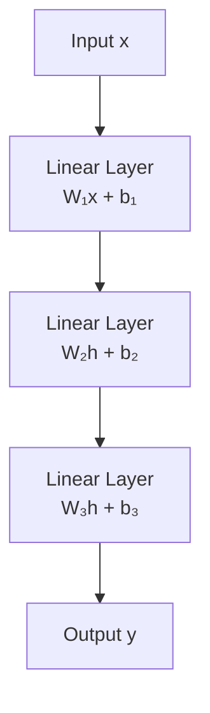
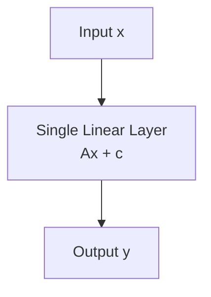
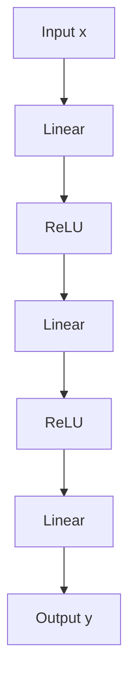
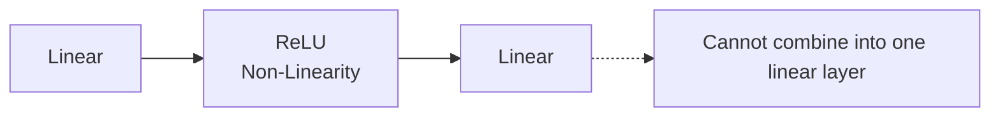

# Activation Functions

## The Problem

A neural network built only from **linear layers** is fundamentally limited.

Consider two consecutive linear transformations:

$$
y = W_2(W_1x+b_1)+b_2
$$

Expanding the equation:

$$
\begin{aligned}
y &= W_2W_1x + W_2b_1 + b_2 \\
  &= Ax + c
\end{aligned}
$$

where

$$
A = W_2W_1
$$

and

$$
c = W_2b_1 + b_2.
$$

Therefore, the entire two-layer network is equivalent to a **single linear transformation**.

This property holds regardless of how many linear layers are stacked together:

$$
W_n(\cdots(W_2(W_1x+b_1)+b_2)\cdots)+b_n
= Ax+c
$$

for some matrix **A** and vector **c**.

As a result, a deep neural network **without activation functions** has exactly the same expressive power as a single linear layer.

Adding more layers only increases the number of parameters—it **does not increase** the complexity of the functions the network can represent.

---

## Practical Limitations

A purely linear network cannot learn nonlinear relationships such as:

- XOR logical function
- Concentric circles
- Spiral datasets
- Complex image recognition
- Speech recognition
- Natural language understanding

Regardless of its depth, such a network can only produce **linear decision boundaries** (hyperplanes).

---

# Why Activation Functions Matter

Activation functions introduce **nonlinearity** after every linear transformation.

Instead of computing

$$
h = W_1x+b_1,
$$

the network computes

$$
h = g(W_1x+b_1),
$$

where \(g(\.)\) is a nonlinear activation function such as:

- ReLU
- Sigmoid
- Tanh
- GELU
- Leaky ReLU
- ELU

The next layer computes

$$
y = W_2g(W_1x+b_1)+b_2.
$$

Unlike the purely linear case,

$$
W_2g(W_1x+b_1)+b_2
$$

**cannot** be simplified into

$$
Ax+c.
$$

Because of the nonlinear activation, the composition of multiple layers no longer collapses into a single matrix multiplication.

Each additional hidden layer therefore increases the network's ability to model more complex relationships.

This simple mathematical change transforms neural networks from linear models into **universal function approximators**.

---

# Mathematical Proof

A linear layer computes

$$
f(x)=Wx+b.
$$

## Case 1: Without Activation Function

### Layer 1

$$
h=W_1x+b_1
$$

### Layer 2

$$
y=W_2h+b_2
$$

Substitute Layer 1 into Layer 2:

$$
\begin{aligned}
y
&=W_2(W_1x+b_1)+b_2 \\
&=W_2W_1x+W_2b_1+b_2 \\
&=Ax+c.
\end{aligned}
$$

Thus,

$$
f_2(f_1(x))
$$

is still a **linear function**.

No matter how many linear layers are stacked together,

$$
f_n(f_{n-1}(\cdots f_1(x)\cdots))
$$

remains

$$
Ax+c.
$$

---

## Case 2: With an Activation Function

### Layer 1

$$
h=g(W_1x+b_1)
$$

### Layer 2

$$
y=W_2h+b_2
$$

Substituting gives

$$
y=W_2g(W_1x+b_1)+b_2.
$$

Since

$$
g(\cdot)
$$

is nonlinear,

$$
W_2g(W_1x+b_1)+b_2
\neq
Ax+c.
$$

The network therefore becomes **nonlinear**, enabling it to learn nonlinear decision boundaries.

---

## Why This Changes Everything

Without activation functions:

- Every hidden layer performs another matrix multiplication.
- The entire network collapses into one linear transformation.
- Decision boundaries remain linear.
- Increasing depth provides **no additional expressive power**.

With activation functions:

- Hidden layers progressively transform the feature space.
- Complex manifolds become linearly separable.
- The network learns hierarchical feature representations.
- Deeper architectures become substantially more expressive.
- Neural networks become universal function approximators.

---

## Visual Intuition

## Without Activation Functions

### Equivalent Representation

> **Key Idea:** Multiple linear layers collapse into a **single linear transformation**.

---

## With Activation Functions

### Why It Cannot Be Simplified

> **Key Idea:** ReLU introduces **non-linearity**, preventing the network from collapsing into a single linear transformation.

---

## Key Takeaways

 Linear layers alone always collapse into a single linear transformation.

$$
\boxed{\text{Deep Linear Network} \equiv \text{Single Linear Layer}}
$$

 Activation functions introduce nonlinearity.

$$
\boxed{\text{Deep Network with Activation} \neq \text{Single Linear Layer}}
$$

 Without nonlinear activations, neural networks cannot solve nonlinear problems such as XOR, image recognition, speech recognition, or language understanding.

---

## Choosing the Right Activation Function

The activation function affects both the expressive power of the model and the flow of gradients during backpropagation.

| Activation | Advantages                                                             | Limitations                                         |
| ---------- | ---------------------------------------------------------------------- | --------------------------------------------------- |
| Sigmoid    | Smooth probabilistic output                                            | Vanishing gradients, not zero-centered              |
| Tanh       | Zero-centered output, stronger gradients than sigmoid                  | Still suffers from vanishing gradients              |
| ReLU       | Fast computation, sparse activations, mitigates vanishing gradients    | Dying ReLU problem for permanently inactive neurons |
| Leaky ReLU | Prevents dead neurons by allowing a small negative slope               | Slightly higher computational cost                  |
| GELU       | Smooth activation with excellent empirical performance in Transformers | More computationally expensive than ReLU            |
| Swish      | Smooth and non-monotonic, often improves deep networks                 | Slower than ReLU                                    |

Improper activation choices can severely hinder optimization:

- **Sigmoid/Tanh**: Gradients shrink toward zero in deep networks, slowing or stopping learning.
- **ReLU**: Neurons receiving consistently negative inputs may become permanently inactive ("dying ReLU").
- **Highly unbounded activations**: Combined with poor initialization or high learning rates, they may contribute to exploding activations or unstable training.

## Conclusion

The remarkable success of modern deep learning comes **not from depth alone**, but from the combination of:

1. Linear transformations (matrix multiplications)
2. Nonlinear activation functions

Without activation functions, a deep neural network is mathematically equivalent to a single linear model. Nonlinear activations unlock the expressive power needed to learn complex patterns, making deep learning possible.