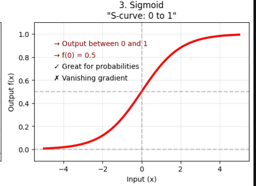

# Sigmoid Activation Function

## Definition

The **Sigmoid activation function** transforms any real-valued input into a value between **0 and 1**. Because of its smooth **S-shaped (sigmoidal)** curve, it is often interpreted as producing a probability.

The sigmoid function is defined as

$$
\sigma(x)=\frac{1}{1+e^{-x}}
$$

where:

- \(x\) is the input (also called the **logit**).
- \(e\) is Euler's number (\(\approx 2.718\)).

Its output always satisfies

$$
0<\sigma(x)<1.
$$

---

## How It Works

For each neuron, the network first computes a weighted sum:

$$
z = Wx+b
$$

The sigmoid activation is then applied:

$$
a=\sigma(z)=\frac{1}{1+e^{-z}}
$$

The output \(a\) becomes the input to the next layer.

---

### Example

Suppose

$$
z=2
$$

Then

$$
\begin{aligned}
\sigma(2)
&=\frac{1}{1+e^{-2}} \\
&=\frac{1}{1+0.1353} \\
&=0.8808
\end{aligned}
$$

The neuron outputs **0.8808**, which can be interpreted as an **88.08% probability** in binary classification.

### Sample Values

| Input \(x\) | Sigmoid Output \(\sigma(x)\) |
|-------------:|-----------------------------:|
| -5 | 0.0067 |
| -2 | 0.1192 |
| -1 | 0.2689 |
| 0 | 0.5000 |
| 1 | 0.7311 |
| 2 | 0.8808 |
| 5 | 0.9933 |

Notice:

- Very negative inputs approach **0**.
- Very positive inputs approach **1**.

---

## Graph Characteristics

The sigmoid function has several important properties:

-  Smooth and differentiable everywhere
-  Monotonically increasing
-  S-shaped (sigmoidal)
-  Output bounded between **0 and 1**
-  Centered at

$$
\sigma(0)=0.5
$$

As the input approaches positive infinity,

$$
\lim_{x\to\infty}\sigma(x)=1
$$

As the input approaches negative infinity,

$$
\lim_{x\to-\infty}\sigma(x)=0
$$

---

## Derivative of Sigmoid

One reason sigmoid became popular is its elegant derivative.

Starting from

$$
\sigma(x)=\frac{1}{1+e^{-x}}
$$

its derivative is

$$
\sigma'(x)=\sigma(x)\left(1-\sigma(x)\right)
$$

This means the gradient can be computed using only the sigmoid output, making **backpropagation efficient**.

---

## Example

If

$$
\sigma(x)=0.8
$$

then

$$
\sigma'(x)=0.8(1-0.8)=0.16
$$

The largest possible derivative occurs at

$$
x=0
$$

because

$$
\sigma(0)=0.5
$$

and

$$
0.5(1-0.5)=0.25
$$

Therefore,

$$
0\le\sigma'(x)\le0.25
$$

---

## Advantages

## 1. Produces Probabilities

Since the output lies between **0 and 1**, sigmoid naturally represents probabilities.

Examples:

- **0.95 → Very likely**
- **0.10 → Very unlikely**

This makes sigmoid ideal for **binary classification**.

---

## 2. Smooth and Differentiable

Gradient-based optimization algorithms such as **Gradient Descent** require differentiable activation functions.

Sigmoid is differentiable everywhere.

---

## 3. Simple Mathematical Form

Its derivative

$$
\sigma'(x)=\sigma(x)(1-\sigma(x))
$$

is computationally convenient during backpropagation.

---

## 4. Historically Important

Sigmoid was widely used in early neural networks and remains common in:

- Logistic Regression
- Binary Classifiers
- Probability estimation

---

# Disadvantages

## 1. Vanishing Gradient Problem

This is sigmoid's biggest weakness.

For large positive or negative inputs, the curve becomes almost flat.

Example:

$$
\sigma(10)=0.99995
$$

Derivative:

$$
0.99995(1-0.99995)\approx0.00005
$$

Similarly,

$$
\sigma(-10)=0.00005
$$

whose derivative is also approximately

$$
0.00005.
$$

During backpropagation, gradients from multiple layers are multiplied together.

Since

$$
\sigma'(x)\le0.25,
$$

the gradient shrinks exponentially.

Example:

$$
0.25^{10}=9.5\times10^{-7}
$$

By the time gradients reach the early layers, they are nearly zero.

As a result:

- Early layers receive almost no updates.
- Training becomes very slow.
- Deep networks become difficult to optimize.

---

## 2. Saturation

For very large positive or negative inputs, neurons become **saturated**.

- Large positive input → Output ≈ 1
- Large negative input → Output ≈ 0

In both cases,

$$
\sigma'(x)\approx0,
$$

so learning nearly stops.

---

## 3. Not Zero-Centered

Sigmoid outputs are always positive:

$$
0<\sigma(x)<1
$$

This leads to:

- Positive mean activations
- Biased gradient updates
- Slower optimization than zero-centered activations such as **Tanh**

---

## 4. Computational Cost

Sigmoid requires computing

$$
e^{-x},
$$

which is computationally more expensive than simple operations such as

$$
\max(0,x)
$$

used by **ReLU**.

---

## Applications

Sigmoid is still widely used in specific tasks:

- Binary Classification
- Logistic Regression
- Binary Sentiment Analysis
- Spam Detection
- Medical Diagnosis
- Binary Object Detection
- Binary Image Segmentation

---

## Why Sigmoid Is Rarely Used in Hidden Layers

Modern deep neural networks usually avoid sigmoid in hidden layers because of the **vanishing gradient problem**.

Instead, hidden layers typically use:

- ReLU
- Leaky ReLU
- GELU
- Swish

These activation functions preserve stronger gradients, allowing much deeper networks to train effectively.

---

## Rule of Thumb

| Network Layer | Recommended Activation |
|---------------|------------------------|
| Hidden Layer | ReLU, Leaky ReLU, GELU, Swish |
| Output Layer (Binary Classification) | Sigmoid |
| Output Layer (Multi-Class Classification) | Softmax |

---

## Key Takeaways

- Sigmoid maps any real number into the interval **(0, 1)**.
- It is ideal for **binary classification outputs**.
- Its derivative is simple:

$$
\sigma'(x)=\sigma(x)(1-\sigma(x)).
$$

- The derivative is always at most **0.25**, which causes the **vanishing gradient problem** in deep networks.
- Modern neural networks rarely use sigmoid in hidden layers but continue to use it in **binary output layers**.