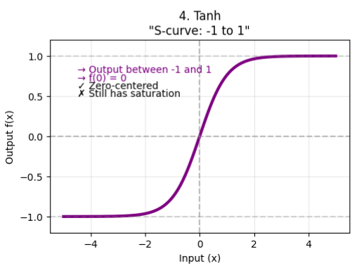

# Tanh (Hyperbolic Tangent) Activation Function

## Definition

The **Tanh (Hyperbolic Tangent)** activation function is a nonlinear activation that maps any real-valued input to the range **(-1, 1)**.

It is similar to the **Sigmoid** activation function but is **zero-centered**, making optimization easier in many neural networks.

The tanh function is defined as

$$
\tanh(x)=\frac{e^x-e^{-x}}{e^x+e^{-x}}
$$

Its output always satisfies

$$
-1<\tanh(x)<1.
$$

---

## How It Works

A neuron first computes a weighted sum:

$$
z=Wx+b
$$

The tanh activation is then applied:

$$
a=\tanh(z)
$$

The resulting output becomes the input to the next layer.

### Example

Suppose

$$
z=2
$$

Then

$$
\tanh(2)\approx0.9640
$$

### Sample Values

| Input \(x\) | Tanh Output \(\tanh(x)\) |
|-------------:|-------------------------:|
| -5 | -0.9999 |
| -2 | -0.9640 |
| -1 | -0.7616 |
| 0 | 0.0000 |
| 1 | 0.7616 |
| 2 | 0.9640 |
| 5 | 0.9999 |

Notice the symmetry:

- Large negative inputs → Output approaches **−1**
- Large positive inputs → Output approaches **+1**
- Zero input → Output is **0**

---

## Graph Characteristics

The tanh function has several important properties:

-  Smooth and differentiable everywhere
-  Nonlinear
-  Monotonically increasing
-  Zero-centered
-  Output bounded between **−1** and **1**

Mathematically,

$$
\tanh(0)=0
$$

As the input approaches positive infinity,

$$
\lim_{x\to\infty}\tanh(x)=1
$$

As the input approaches negative infinity,

$$
\lim_{x\to-\infty}\tanh(x)=-1
$$

---

# Derivative of Tanh

The derivative of tanh is

$$
\frac{d}{dx}\tanh(x)=1-\tanh^2(x)
$$

Unlike sigmoid, the derivative is largest at the origin.

---

## Example

If

$$
\tanh(x)=0.6
$$

then

$$
\begin{aligned}
\tanh'(x)
&=1-0.6^2\\
&=1-0.36\\
&=0.64
\end{aligned}
$$

At

$$
x=0,
$$

we have

$$
\tanh(0)=0,
$$

therefore

$$
\tanh'(0)=1.
$$

This is much larger than sigmoid's maximum derivative (**0.25**), allowing gradients to flow more effectively during training.

---

## Relationship Between Sigmoid and Tanh

The tanh function is closely related to the sigmoid function:

$$
\tanh(x)=2\sigma(2x)-1
$$

where

$$
\sigma(x)=\frac{1}{1+e^{-x}}.
$$

This relationship explains why tanh has a similar **S-shaped curve** but is centered around zero.

---

## Advantages

## 1. Zero-Centered Output

Unlike sigmoid,

$$
-1<\tanh(x)<1,
$$

so the average activation is closer to zero.

This leads to:

- More balanced gradient updates
- Faster convergence
- Better optimization

---

## 2. Stronger Gradients Near Zero

The maximum derivative is

$$
\tanh'(0)=1.
$$

This is **four times larger** than sigmoid's maximum derivative:

$$
0.25.
$$

As a result, learning proceeds more efficiently for inputs near zero.

---

## 3. Smooth and Differentiable

Tanh is differentiable everywhere, making it suitable for gradient-based optimization algorithms such as **Gradient Descent**.

---

## 4. Better Than Sigmoid for Hidden Layers

Historically, tanh replaced sigmoid in many hidden layers because its zero-centered outputs generally improve optimization.

---

## Disadvantages

## 1. Vanishing Gradient Problem

Although tanh performs better than sigmoid near zero, it still suffers from the **vanishing gradient problem**.

For large inputs,

$$
\tanh(10)\approx1
$$

and

$$
\tanh(-10)\approx-1.
$$

In both cases,

$$
\tanh'(x)\approx0.
$$

During backpropagation, gradients from many layers are multiplied together.

Eventually, the gradients reaching early layers become extremely small, causing:

- Slow learning
- Poor convergence
- Difficulty training deep networks

---

## 2. Saturation

When inputs become very positive or very negative, the output saturates at **±1**.

Once saturated,

$$
\tanh'(x)\approx0,
$$

making further weight updates negligible.

---

## 3. More Computationally Expensive Than ReLU

Like sigmoid, tanh requires exponential calculations:

$$
e^x,\quad e^{-x}
$$

making it slower than simple piecewise-linear activations such as **ReLU**.

---

## Applications

Tanh is commonly used in:

- Hidden layers of shallow neural networks
- Recurrent Neural Networks (RNNs)
- LSTMs (candidate cell states and hidden state transformations)
- Sequence modeling
- Time-series forecasting

Although still important in recurrent architectures, modern feedforward and convolutional networks usually favor **ReLU-based** activations.

---

## Tanh vs Sigmoid

| Feature | Sigmoid | Tanh |
|---------|---------|------|
| Output Range | (0, 1) | (-1, 1) |
| Zero-Centered |   No |   Yes |
| Maximum Derivative | 0.25 | 1.0 |
| Vanishing Gradient | Severe | Less severe, but still present |
| Hidden Layers | Rarely used | Better than Sigmoid, but largely replaced by ReLU |
| Output Layer | Binary Classification | Rarely used |

---

## Why Tanh Is Less Common Today

Although tanh is an improvement over sigmoid, it still suffers from gradient saturation in deep networks.

Modern architectures typically use:

- ReLU
- Leaky ReLU
- GELU
- Swish

These activation functions maintain stronger gradients, allowing much deeper models to train efficiently.

---

## Rule of Thumb

| Layer | Recommended Activation |
|--------|------------------------|
| Hidden Layers (Modern CNNs/MLPs) | ReLU, Leaky ReLU, GELU, Swish |
| RNNs/LSTMs | Tanh (internally) |
| Binary Classification Output | Sigmoid |
| Multi-Class Classification Output | Softmax |

---

## Key Takeaways

- Tanh maps any real-valued input to the interval **(-1, 1)**.
- It is **zero-centered**, making optimization more efficient than sigmoid.
- Its derivative is

$$
\boxed{\frac{d}{dx}\tanh(x)=1-\tanh^2(x)}
$$

- The maximum derivative is

$$
\boxed{\tanh'(0)=1,}
$$

which is significantly larger than sigmoid's maximum derivative (**0.25**).

- Despite its advantages, tanh still suffers from the **vanishing gradient problem** for large positive or negative inputs.
- Modern deep learning models typically use **ReLU-family activations**, while tanh remains an important component of **RNNs** and **LSTMs**.