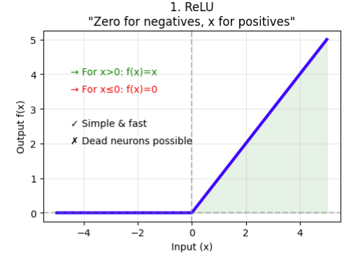

# ReLU (Rectified Linear Unit) Activation Function

## Definition

The **Rectified Linear Unit (ReLU)** is the most widely used activation function in modern deep learning. It introduces **nonlinearity** while remaining computationally simple, making it the default activation function for many neural networks, including:

- Convolutional Neural Networks (CNNs)
- Multi-Layer Perceptrons (MLPs)
- Some Transformer components

The ReLU function is defined as

$$
f(x)=\max(0,x)
$$

This means:

- If \(x>0\), the output is \(x\).
- If \(x\le0\), the output is \(0\).

Unlike **Sigmoid** and **Tanh**, ReLU is **not bounded above**.

Its output range is

$$
0\le f(x)<\infty.
$$

---

## Graph of ReLU

The ReLU graph consists of:

- A horizontal line at \(y=0\) for all negative inputs.
- A straight line \(y=x\) for all positive inputs.

   

---

## How It Works

A neuron first computes

$$
z=Wx+b
$$

Then the ReLU activation is applied:

$$
a=\max(0,z)
$$

The activated output \(a\) becomes the input to the next layer.

---

### Example

| Input \(x\) | ReLU Output \(f(x)\) |
|------------:|---------------------:|
| -5 | 0 |
| -2 | 0 |
| -1 | 0 |
| 0 | 0 |
| 1 | 1 |
| 2 | 2 |
| 5 | 5 |

Notice:

- All **negative values become zero**.
- Positive values remain **unchanged**.

---

## Mathematical Definition

$$
f(x)=
\begin{cases}
0, & x<0\\
x, & x\ge0
\end{cases}
$$

---

## Derivative of ReLU

The derivative is

$$
f'(x)=
\begin{cases}
0, & x<0\\
1, & x>0
\end{cases}
$$

At

$$
x=0,
$$

the derivative is **mathematically undefined**.

In practice, deep learning libraries simply define it as **0** (or sometimes **1**), which works well during training.

---

### Example

Suppose

$$
x=-3.
$$

Then

$$
f(-3)=0
$$

and

$$
f'(-3)=0.
$$

For

$$
x=5,
$$

we obtain

$$
f(5)=5
$$

and

$$
f'(5)=1.
$$

---

## Why ReLU Works So Well

Unlike **Sigmoid** and **Tanh**, ReLU does **not saturate for positive values**.

For positive inputs,

$$
f'(x)=1.
$$

Therefore, gradients remain large as they pass through many layers.

During backpropagation,

$$ \frac{\partial L}{\partial x} =
\frac{\partial L}{\partial y}
\times
f'(x).
$$

Since

$$
f'(x)=1,
$$

the gradient is preserved instead of shrinking.

This property largely eliminates the **vanishing gradient problem** that affected early deep neural networks using Sigmoid or Tanh.

---

## Advantages

## 1. Computationally Efficient

ReLU requires only a simple comparison:

$$
\max(0,x).
$$

There are no expensive exponential calculations, making ReLU much faster than Sigmoid and Tanh.

---

## 2. Reduces the Vanishing Gradient Problem

For positive inputs,

$$
f'(x)=1,
$$

allowing gradients to flow effectively through deep networks.

This enables the successful training of very deep architectures.

---

## 3. Sparse Activation

Negative inputs produce exactly zero:

$$
f(x)=0.
$$

As a result:

- Only a subset of neurons are active.
- Sparse representations improve computational efficiency.
- Sparse activations often improve generalization.

---

## 4. Faster Convergence

Because gradients remain stronger, networks using ReLU typically converge much faster than those using Sigmoid or Tanh.

---

## 5. State-of-the-Art Performance

ReLU is the default activation in many successful architectures, including:

- AlexNet
- VGG
- ResNet
- DenseNet
- EfficientNet
- MobileNet

---

## Disadvantages

## 1. Dying ReLU Problem

This is ReLU's biggest weakness.

If a neuron's input becomes permanently negative,

$$
x<0,
$$

then

$$
f(x)=0
$$

and

$$
f'(x)=0.
$$

During backpropagation,

$$
\frac{\partial L}{\partial x}=0.
$$

As a result:

- The neuron's weights stop updating.
- The neuron becomes permanently inactive ("dead").

This often occurs when:

- Learning rate is too high.
- Weights are poorly initialized.
- Biases become strongly negative.

Variants such as **Leaky ReLU**, **PReLU**, and **ELU** were developed to mitigate this problem.

---

## 2. Not Zero-Centered

Since

$$
f(x)\ge0,
$$

ReLU outputs are not zero-centered.

Although this is generally less problematic than Sigmoid, it can still affect optimization dynamics.

---

## 3. Unbounded Output

For very large positive inputs,

$$
f(x)\rightarrow\infty.
$$

Without:

- Proper weight initialization
- Batch Normalization
- Appropriate learning rates

activations can become excessively large, leading to unstable training.

---

## Applications

ReLU is widely used in:

- Convolutional Neural Networks (CNNs)
- Feedforward Neural Networks (MLPs)
- Computer Vision
- Object Detection
- Image Segmentation
- Speech Recognition
- Recommendation Systems

Although Transformers often use **GELU**, ReLU remains one of the most important activation functions in deep learning.

---

## ReLU vs Sigmoid vs Tanh

| Feature | Sigmoid | Tanh | ReLU |
|---------|---------|------|------|
| Output Range | (0,1) | (-1,1) | [0,∞) |
| Zero-Centered |   No |   Yes |   No |
| Vanishing Gradient | Severe | Moderate | Minimal (positive inputs) |
| Computational Cost | High (Exponential) | High (Exponential) | Very Low |
| Sparse Activations |   No |   No |   Yes |
| Hidden Layers | Rarely Used | Occasionally Used | Widely Used |
| Output Layer | Binary Classification | Rarely Used | Rarely Used |

---

# Why ReLU Became the Standard

Before **2012**, deep neural networks were difficult to train because **Sigmoid** and **Tanh** caused gradients to vanish.

ReLU addressed this issue by maintaining

$$
f'(x)=1
$$

for positive inputs, allowing gradients to propagate through many layers.

Its:

- Simplicity
- Computational efficiency
- Strong empirical performance

made it the default activation function in many breakthrough architectures, including **AlexNet**, which demonstrated the power of deep learning for large-scale image recognition.

---

# Key Takeaways

- ReLU is defined as

$$
\boxed{f(x)=\max(0,x)}
$$

- Negative inputs become **0**.
- Positive inputs remain **unchanged**.
- ReLU greatly reduces the **vanishing gradient problem**.
- It enables efficient training of very deep neural networks.
- It is computationally inexpensive.
- Its primary drawback is the **Dying ReLU Problem**, which inspired variants such as **Leaky ReLU**, **PReLU**, and **ELU**.

> **Rule of Thumb**
>
> - **Hidden Layers:** ReLU (or its variants such as Leaky ReLU, GELU, Swish)
> - **Binary Classification Output:** Sigmoid
> - **Multi-Class Classification Output:** Softmax