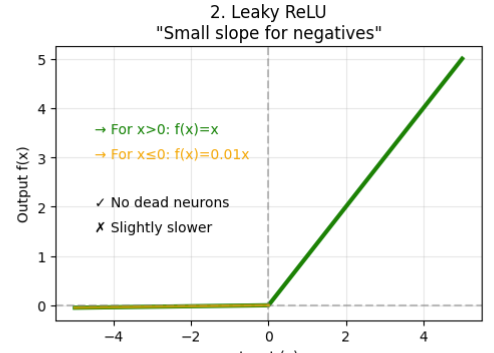

# Leaky ReLU (Leaky Rectified Linear Unit)

## Definition

**Leaky ReLU (Leaky Rectified Linear Unit)** is an improved version of the **ReLU** activation function. It was introduced to solve ReLU's major drawback—the **Dying ReLU Problem**.

Instead of outputting **0** for all negative inputs, Leaky ReLU allows a **small, non-zero gradient** for negative values.

The Leaky ReLU function is defined as

$$
f(x)=
\begin{cases}
x, & x>0\\
\alpha x, & x\le0
\end{cases}
$$

where:

- \(x\) is the input.
- \(\alpha\) is a small positive constant (typically **0.01**).

Unlike ReLU, which completely blocks negative inputs, Leaky ReLU allows a small amount of information to pass through the negative region.

---

## Graph of Leaky ReLU

The graph consists of:

- A line with slope **1** for positive inputs (same as ReLU).
- A line with a small slope **α** for negative inputs.

Notice:

- **Positive inputs:** identical to ReLU.
- **Negative inputs:** have a small positive slope instead of being flat.

---

## How It Works

A neuron first computes

$$
z=Wx+b
$$

The Leaky ReLU activation is then applied:

$$
a=
\begin{cases}
z, & z>0\\
0.01z, & z\le0
\end{cases}
$$

The activated output becomes the input to the next layer.

---

### Example

Assume

$$
\alpha=0.01.
$$

| Input \(x\) | Leaky ReLU Output |
|------------:|------------------:|
| -5 | -0.05 |
| -2 | -0.02 |
| -1 | -0.01 |
| 0 | 0 |
| 1 | 1 |
| 2 | 2 |
| 5 | 5 |

Unlike ReLU, **negative inputs are not forced to zero**.

---

## Mathematical Definition

$$
f(x)=
\begin{cases}
x, & x>0\\
\alpha x, & x\le0
\end{cases}
$$

where

$$
\alpha\approx0.01
$$

is usually chosen manually.

---

# Derivative of Leaky ReLU

The derivative is

$$
f'(x)=
\begin{cases}
1, & x>0\\
\alpha, & x<0
\end{cases}
$$

For the common choice

$$
\alpha=0.01,
$$

the derivative becomes

$$
f'(x)=
\begin{cases}
1, & x>0\\
0.01, & x<0
\end{cases}
$$

At

$$
x=0,
$$

the derivative is mathematically **undefined**, but deep learning libraries assign a practical value during optimization.

---

### Example

Suppose

$$
x=-4.
$$

Then

$$
f(-4)=0.01(-4)=-0.04
$$

and

$$
f'(-4)=0.01.
$$

For

$$
x=3,
$$

we obtain

$$
f(3)=3
$$

and

$$
f'(3)=1.
$$

Notice that even for **negative inputs**, the gradient is **not zero**.

---

## Why Leaky ReLU Solves the Dying ReLU Problem

Recall that standard ReLU is

$$
f(x)=\max(0,x).
$$

If a neuron always receives negative inputs,

$$
f(x)=0
$$

and

$$
f'(x)=0.
$$

During backpropagation,

$$\frac{\partial L}{\partial x}=
\frac{\partial L}{\partial y}
\times0
=0.
$$

The weights stop updating, causing the neuron to become permanently inactive (**dead neuron**).

Leaky ReLU avoids this problem by assigning a small slope to the negative region:

$$
f'(x)=\alpha.
$$

Since

$$
\alpha>0,
$$

the gradient is **never completely zero**, allowing neurons to continue learning even when their inputs are negative.

---

## Advantages

## 1. Prevents Dead Neurons

The primary advantage is that neurons remain trainable because negative inputs still produce a small gradient.

---

## 2. Reduces the Vanishing Gradient Problem

For positive inputs,

$$
f'(x)=1,
$$

allowing gradients to flow effectively through deep networks.

Even for negative inputs,

$$
f'(x)=\alpha>0,
$$

so gradients never completely disappear.

---

## 3. Computationally Efficient

Like ReLU, Leaky ReLU requires only:

- One comparison
- One multiplication

making it much faster than **Sigmoid** or **Tanh**.

---

## 4. Better Feature Learning

Since negative activations are retained (although scaled down), the network preserves more information than standard ReLU.

---

## 5. Faster Training

Networks using Leaky ReLU often converge faster than those using Sigmoid or Tanh and may outperform standard ReLU when many neurons would otherwise become inactive.

---

## Disadvantages

## 1. Hyperparameter Selection

The slope

$$
\alpha
$$

must be chosen manually.

Common choices include:

- 0.01
- 0.02
- 0.1

Different tasks may require different values.

---

## 2. Not Zero-Centered

Like ReLU,

$$
f(x)\neq0
$$

on average.

Although allowing negative outputs reduces this issue, Leaky ReLU is still **not perfectly zero-centered**.

---

## 3. Limited Improvement

On many datasets, Leaky ReLU performs only slightly better than ReLU.

The improvement is often **problem-dependent**.

---

## Applications

Leaky ReLU is commonly used in:

- Deep Feedforward Networks (MLPs)
- Convolutional Neural Networks (CNNs)
- Generative Adversarial Networks (GANs)
- Computer Vision
- Object Detection
- Image Classification

It is especially useful when standard ReLU causes many neurons to become inactive.

---

## ReLU vs Leaky ReLU

| Feature | ReLU | Leaky ReLU |
|---------|------|------------|
| Formula | $\max(0,x)$ | $\max(\alpha x,x)$ |
| Negative Output | Always 0 | Small Negative Value |
| Gradient for \(x<0\) | 0 | \(\alpha\) (e.g., 0.01) |
| Dying ReLU Problem | Can Occur | Greatly Reduced |
| Computational Cost | Very Low | Very Low |
| Hyperparameter | None | Requires Choosing \(\alpha\) |

---

## Leaky ReLU vs Sigmoid vs Tanh

| Feature | Sigmoid | Tanh | Leaky ReLU |
|---------|---------|------|------------|
| Output Range | (0,1) | (-1,1) | (-∞,∞) |
| Zero-Centered |   No |   Yes | Partially |
| Vanishing Gradient | Severe | Moderate | Minimal |
| Dead Neurons | No | No | Rare |
| Training Speed | Slow | Moderate | Fast |
| Hidden Layers | Rare | Sometimes | Common |

---

## Variants of Leaky ReLU

Several activation functions build upon the idea of Leaky ReLU.

### PReLU (Parametric ReLU)

Instead of fixing the negative slope,

$$
\alpha,
$$

the network learns it automatically during training.

---

### RReLU (Randomized ReLU)

Uses a **random negative slope** during training, providing additional regularization.

---

### ELU (Exponential Linear Unit)

Uses an exponential curve for negative inputs, producing smoother activations.

---

### SELU (Scaled ELU)

Designed specifically for **Self-Normalizing Neural Networks (SNNs)**.

---

## Key Takeaways

- Leaky ReLU is defined as

$$
\boxed{
f(x)=
\begin{cases}
x,&x>0\\
\alpha x,&x\le0
\end{cases}
}
$$

- Unlike ReLU, it allows **small negative outputs**.
- The gradient is never completely zero:

$$
\boxed{
f'(x)=
\begin{cases}
1,&x>0\\
\alpha,&x<0
\end{cases}
}
$$

- It greatly reduces the **Dying ReLU Problem** while retaining ReLU's computational efficiency.
- It is widely used in **CNNs**, **GANs**, and deep feedforward networks when standard ReLU results in inactive neurons.

> **Rule of Thumb**
>
> - **Hidden Layers:** ReLU, Leaky ReLU, GELU, or Swish
> - **If many neurons die:** Prefer Leaky ReLU or PReLU
> - **Binary Classification Output:** Sigmoid
> - **Multi-Class Classification Output:** Softmax